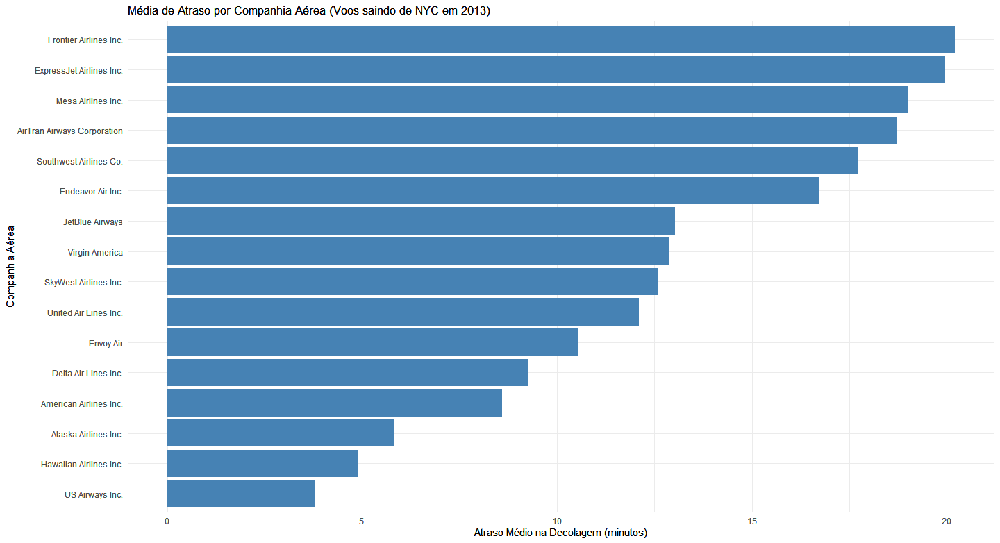

# ✈️ Análise de Atrasos em Voos - Nova York 2013

Bem-vindo a este projeto de análise de dados dos voos registrados em Nova York em 2013!  
Aqui usamos R e visualizações para entender melhor os **atrasos nas decolagens por companhia aérea**.

---

## 📌 Objetivo

> ✈️ **Descobrir quais companhias aéreas tiveram maior média de atraso em 2013.**  
> 💡 Utilizamos dados reais do pacote `nycflights13` para explorar, agrupar, calcular médias e visualizar.

---

## 🔧 Tecnologias Utilizadas

- **R** (linguagem de programação)
- **pacotes:** `dplyr`, `ggplot2`, `nycflights13`
- **Gráfico gerado com:** `ggplot2`

---

## 🛫 Etapas da Análise

1. Importação dos dados (`flights`)
2. Limpeza e agrupamento por companhia (`carrier`)
3. Cálculo da média de atraso
4. Visualização em gráfico de barras

---

## 📊 Resultado Visual

## Gráfico de Atrasos por Companhia Aérea

<p align="center">
  
</p>


---

## 🗂️ Estrutura do Projeto

```
analise-atrasos-voos/
├── analise_atrasos_voos.R       # Script com toda a análise no R
├── grafico_atrasos.png          # Imagem gerada pelo ggplot2
├── README.md                    # Documentação do projeto
```

---

## 🌐 Fonte dos Dados

Os dados fazem parte do pacote [`nycflights13`](https://cran.r-project.org/web/packages/nycflights13/index.html), que contém todos os voos que partiram de NYC em 2013.

---

## 🚀 Como Executar o Projeto

1. Clone este repositório:
```bash
git clone https://github.com/glauciavanessa/analise-atraso-voos.git
```
2. Abra o script `analise_atrasos_voos.R` no RStudio
3. Execute as linhas do script para gerar o gráfico

---

## 📬 Contato

Caso queira trocar ideias, me chame por aqui mesmo no GitHub!  
Feito com 💙 por Gláucia Vanessa.